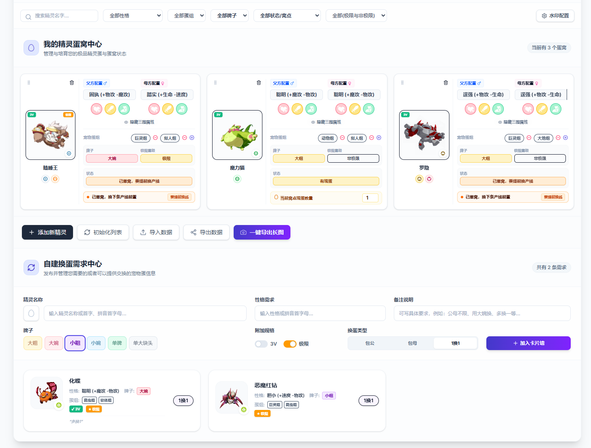
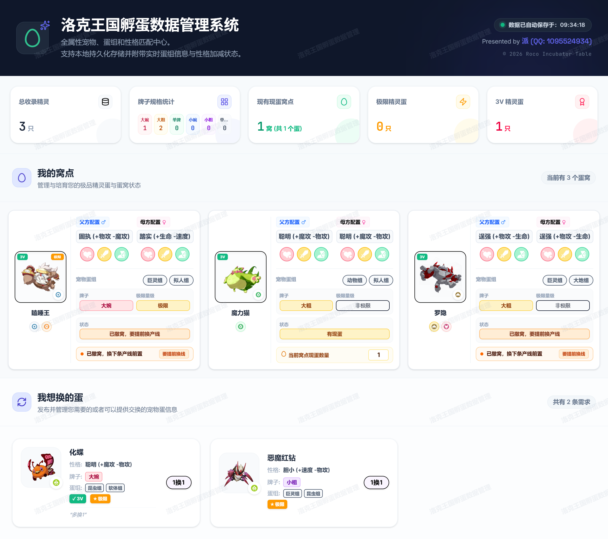

# 🥚 洛克王国孵蛋数据管理系统 (Roco Incubator Table)

> **全属性宠物、蛋组和性格匹配中心，专为洛克王国孵蛋高端玩家打造的桌面数据管理系统。**  
> 支持本地持久化自动保存、可拖拽排序对齐、一键导出防盗长图以及智能 3V 蛋自动统计。

---

## ✨ 核心特性

### 🪺 蛋窝与需求中心

- **🎮 高效双向匹配筛选**：支持按宠物名、性格、蛋组、牌子、窝点状态以及是否极限等条件进行多维复合检索，快速定位最匹配的父母。
- **🎭 精灵多形态支持与极简交互**：
  - **全形态智能匹配**：系统支持精灵多种外观形态（如冬羽雀的四季形态、丢丢的各种地形形态等）。通过识别带下划线的特定命名（如 `冬羽雀_春天的样子`），底层重构的匹配模块能够自动剥离出基础名 `冬羽雀` 来关联其属性与蛋组。
  - **多点位极简交互**：
    - **蛋窝卡片**：如果该精灵拥有多形态，其大头像左下角将优雅地展示出毛玻璃质感的形态切换下拉框。
    - **表格行编辑**：在编辑表格视图下，精灵名称输入框右侧也新增了形态选择下拉菜单，方便玩家快速切换。
    - **发布需求表单**：在换蛋中心的需求发布表单中，只要输入有形态的精灵，输入框右侧即刻渲染对应的形态选择下拉框，并实现头像预览联动切换。
    - **需求看板卡片**：在发布到看板的卡片上，同样支持行内快速下拉切换，更新状态。
  - **升级进化链保留形态**：不管是表格行升级、蛋窝卡片升级还是换蛋发布时，系统在自动将其升级为最高阶形态的同时，将完美保留后缀形态。
  - **长图导出自动剔除**：形态切换下拉框绑定了 `.action-buttons` 过滤样式，当用户一键导出防盗长图时，所有切换下拉框将智能隐形，确保最终导出的长图美观无暇。
- **🔀 智能拖拽物理排序**：基于 `@dnd-kit` 开发的表格行拖拽系统，玩家可以通过左侧手柄自由调节宠物物理展示顺序，重新排布孵蛋优先级。
- **🧬 智能 3V 蛋检测与计数**：
  - 系统会自动对比父母的"三围"（生命、物攻、速度等）属性配置。
  - **当父母的三围属性完全一致时，系统会自动将该数据行高亮，并标记为「3V蛋」**。
  - 顶部统计面板会实时显示「3V蛋」的总只数，极大提升培养效率。

---

### 👪 父母本管理中心

- **🃏 精美父母本卡片**：为每只父/母精灵创建独立管理卡片，涵盖精灵头像（支持多形态切换）、属性系别徽章、标准身高体重参考（来自全图鉴数据库，多形态差异化匹配）、牌子 / 身高 / 体重 / 性格 / 三围等核心属性，全部实时编辑并持久化存储。
- **🤖 智能繁育配对联动**：在繁育配对结果中，点击卡片即可选中（左上角出现绿色勾勾），支持单选或全选后一键导入父母本，自动填充蛋组、性格、三围等信息。

---

### 🌐 通用功能

- **💾 本地免安装自动持久化**：
  - 系统会在后台默默保护您的心血。任何数据的增删改动都会即时自动保存到本地物理文件夹下的 `roco_egg_data.json` 中。
  - 底部存储路径展示清晰，点击 **「修改」** 按钮可随意指定本地存盘文件夹（如果新文件夹下已有数据则会自动读取，无数据则自动同步写入），完美满足备份需求。
- **📸 一键防盗长图导出**：
  - 点击底部的 **「一键导出长图」** 按钮，系统会智能隐藏所有拖拽手柄、操作按钮和筛选栏等干扰元素，直接渲染为纯净的高清表格长图。
  - 支持后台自由配置**水印内容、水印大小与透明度**，在导出的长图背景中会渲染重叠倾斜的防盗水印，发群里、贴吧交流时再也不怕被盗图。
- **📱 全设备响应式适配**：
  - 完整适配手机端（320px–480px）到 PC 端（1200px+）的全视口范围，无需下载 App 即可在手机浏览器流畅使用。
  - 蛋窝卡片采用移动端垂直堆叠 / PC 端网格双轨布局，确保在任意屏幕尺寸下均无文字折行重叠与元素变形。
  - `Autocomplete` 下拉浮层接入 `visualViewport` API，智能感知软键盘弹出后的实际视口高度，自动翻转到键盘上方弹出，杜绝输入框被遮挡。
  - 长图导出采用 1200px 离屏渲染物理隔离，移动端响应式改动**不影响**导出画质，始终输出高保真 PC 端排版。
- **💻 精致的桌面便携体验 (Electron)**：
  - 采用 **`001.ico`** 作为 Windows 应用专属图标。
  - 隐藏了顶部冗余的菜单栏和控制按钮，保持纯净沉浸的客户端操作体验。
  - 精准配置了 **`1420x850`** 的初始窗口大小，并针对窄屏提供横向滚动条自适应保障，确保表格列在任何屏幕下都不会被无故裁剪截断。
- **ℹ️ 关于 & 致谢弹窗**：Banner 右侧提供「关于 & 致谢」按钮，内含数据来源链接、特别鸣谢信息及作者联系方式。

---

## 🖼️ 界面预览

### 💻 客户端主界面
以下为洛克王国孵蛋数据管理系统的实际运行效果，支持多种高对比底色的牌子与状态标签展示，以及紧凑美观的垂直等距排版：



### 📸 一键导出的防盗水印长图效果
支持一键渲染为长图，自动隐藏操作按钮、拖拽手柄及筛选栏，同时在背景上覆盖倾斜的防盗水印：



---

## 🛠 技术栈

| 类别 | 技术 | 说明 |
|------|------|------|
| **语言** | TypeScript / TSX | 前端主要逻辑与 React 组件 |
| **语言** | JavaScript (CommonJS `.cjs`) | Electron 主进程与预加载脚本 |
| **语言** | Python | 爬虫脚本，用于抓取游戏基础数据 |
| **前端框架** | React | UI 组件化框架 |
| **构建工具** | Vite | 开发服务器与生产构建，配置 `base: './'` 支持 `file://` 协议 |
| **样式** | TailwindCSS | 原子化 CSS 样式框架 |
| **桌面封装** | Electron | 将 Web 应用封装为 Windows 桌面 `.exe` |
| **打包工具** | electron-builder | 生成单文件便携绿色版 EXE |
| **拖拽排序** | @dnd-kit | 表格行拖拽排序功能 |
| **长图导出** | html2canvas | 一键将表格渲染为带水印的高清长图 |
| **动画** | motion/react | 弹窗与交互元素过渡动画 |
| **数据存储** | 本地 JSON 文件 | `roco_egg_data.json` 自动持久化，支持自定义存储路径 |
| **图鉴数据** | `images/全图鉴.json` | 涵盖所有精灵标准身高、体重及多形态数据 |

---

## 🚀 开发者快速启动指南

### 1. 本地开发调试
1. 确保安装了 **Node.js** 环境。
2. 克隆项目或在工作区根目录下执行：
   ```bash
   npm install
   ```
3. 启动 Vite 本地开发服务器：
   ```bash
   npm run dev
   ```
4. 启动 Electron 桌面调试环境：
   ```bash
   npm run electron:start
   ```

### 2. 构建与打包
- **静态资源编译**（生成静态网页）：
  ```bash
  npm run build
  ```
- **Windows 便携版 EXE 打包**（一键生成自带 `001.ico` 图标的绿色便携版程序）：
  ```bash
  npm run electron:build
  ```
  打包成功后，可在根目录下的 `dist-electron/` 目录中找到 **`洛克王国孵蛋数据管理系统 4.0.0.exe`**。

---

## 📦 数据来源与致谢

本工具的所有精灵数据来源于：

- 🌐 [洛克王国:手游WIKI — 精灵图鉴/原始形态](https://wiki.biligame.com/rocom/精灵图鉴/原始形态)
- 🌐 [roco.gptvip.chat — 精灵数据平台](https://roco.gptvip.chat/)

精灵身高体重范围与精灵蛋数据由 **孟德尔实验室群（群号：1101858898）** 的 **cinene** 精心整理汇总。

> 🏅 **特别鸣谢** 孟德尔实验室为洛克王国社区提供的优质数据资源！

---

## 👤 作者信息

| 项目 | 信息 |
|------|------|
| **作者** | 派 |
| **作者 QQ** | `1095524934` |
| **交流反馈群** | `474567570` |
| **项目地址** | [GitHub](https://github.com/PAIZ1999/roco_egg_master) |
| **当前版本** | `v4.0.0` |

> 如有使用问题、BUG 反馈或功能建议，欢迎加入 QQ 反馈群 **474567570** 与作者直接交流！

---

## 🤝 参与贡献

如果您在使用过程中发现任何 BUG 或有更好的优化建议（例如支持更多的性格/属性联动计算），欢迎：
- 加入 QQ 反馈群：**474567570**
- 联系作者 QQ：**1095524934**
- 提交 GitHub Issue 或 Pull Request

*祝所有洛克王国的勇士们，孵蛋顺利，神宠不断！* 🎉
