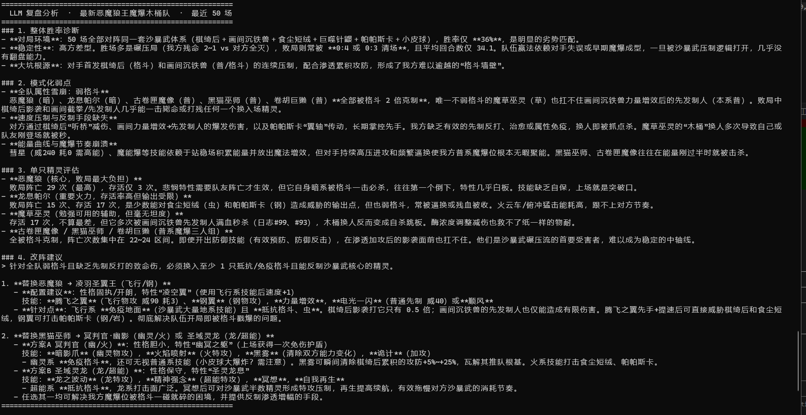

<p align="center">
  
</p>

<h1 align="center">洛克王国对战模拟器 · Roco Data</h1>

<p align="center">
  <em>v1.3 — 数据爬虫 · 战斗引擎 · MCTS / LLM 对战智能体 · PVP 自动化 · MariaDB 战斗日志 · LLM 复盘</em>
</p>

---

爬取 BWIKI 精灵图鉴 + 玩家配队，附带终端图鉴查看器、自由组队战斗模拟器，以及基于 **蒙特卡洛树搜索（MCTS）** 的 AI 智能体，支持 YAML 策略配置、LLM 智能体对战、批量训练并发加速。v1.1 新增 **游戏客户端自动化模块** 直接驱动游戏进行 PVP 自动战斗；v1.3 接入 **MariaDB 战斗日志** 与 **LLM 聚合复盘**，可对历史 N 场对战做模式分析与改阵建议。

> ⚠️ **战斗模拟器仅供参考，结果不代表真实游戏表现。**
> 详见「[模拟器精度说明](#模拟器精度说明)」章节。

> 🚧 **功能完成度提示：**
> - **PVP 自动挑战（v1.1）** 仍处于 **开发阶段**，实际游戏环境下尚未稳定跑通，目前仅提供模板匹配 + 操作框架，**不保证可用**。
> - **LLM 辅助功能（智能体 / 组队 / 策略生成 / 聚合复盘）** 属于 **玩具阶段**，输出仅供参考娱乐，**不应作为真实对战决策依据**。模型对洛克王国游戏机制理解有限，分析结论可能与实际相差较大。

---

## 功能一览

| 功能 | 说明 |
|------|------|
| 🕷️ 全量爬取 | 抓取 BWIKI 上全部精灵数据，保存为 JSON 和 CSV |
| 🔄 检查更新 | 对比本地与 wiki 的差异，仅增量爬取新增精灵 |
| 📚 BWIKI 阵容 | 抓取 BWIKI 玩家配队（PVP/PVE），可一键导入名册 |
| 📖 图鉴查看器 | 在终端按页浏览每只精灵的完整信息，支持搜索 |
| ⚔️ 战斗模拟器 | 自由组队 + 队伍名册，完整战斗机制模拟 |
| 🤖 MCTS AI | 蒙特卡洛树搜索智能体，支持积累对局经验，YAML 策略配置 |
| 🧠 LLM 智能体 | OpenAI 兼容协议（DeepSeek 等），可代替 MCTS 做决策与组队 |
| 📋 队伍名册 | 队伍持久化存储，内置预设 + 用户自定义，随时调取并编辑 |
| 🖼️ 图片导入 | 识别游戏内队伍分享截图，自动解析精灵和技能并存入名册 |
| 🎮 PVP 自动挑战 🚧 | 驱动游戏客户端自动战斗（v1.1，**开发中，未稳定跑通**） |
| 🗄️ MariaDB 后端 | 经验库 / 对战记录 / 详细战斗日志可写入 MariaDB（v1.3） |
| 🔍 LLM 聚合复盘 🧪 | 对一支队伍最近 ≤100 场对战做胜率诊断 + 改阵建议（v1.3，**玩具阶段，仅供参考**） |

---

## 环境要求

- Python 3.10+

```bash
pip install -r requirements.txt
```

### 依赖说明

| 库 | 用途 | 是否必须 |
|----|------|----------|
| `requests` | 爬虫网络请求 | ✅ |
| `beautifulsoup4` | 爬虫 HTML 解析 | ✅ |
| `rich` | 图鉴查看器 UI | ✅ |
| `pyyaml` | YAML 策略配置文件解析 | ✅ |
| `loguru` | PVP 自动战斗日志 | PVP 功能必须 |
| `pywin32` | Windows 窗口操作（截图/按键/鼠标） | PVP 功能必须 |
| `opencv-python` | 模板图像匹配 | PVP 功能必须 |
| `anthropic` | 图片导入 — API 识别方式 | 可选 |
| `rapidocr-onnxruntime` | 图片导入 — 本地 OCR（轻量，约 50MB） | 可选 |
| `easyocr` | 图片导入 — 本地 OCR（高精度，依赖 PyTorch） | 可选 |

图片导入功能至少安装 `anthropic` 或 `rapidocr-onnxruntime` 其中一个。

---

## 快速启动

### 方式一：双击 run.bat（Windows 推荐）

```
============================================
  Rocom Helper  v1.3
============================================
  1. Scrape sprites              (rocom wiki)
  2. Check for sprite updates
  3. Scrape BWIKI lineups        (player teams)
  4. Browse sprites              (viewer)
  5. Battle simulator            (teams / import / PVP / LLM review)
  6. Train MCTS                  (self-play loop)
  7. Manage experience DB
  0. Exit
============================================
```

### 方式二：命令行

```bash
python rocom_scraper.py                 # 全量爬取（自动跳过已有精灵）
python rocom_scraper.py --force         # 强制重爬所有精灵
python viewer.py                        # 图鉴查看器
python battle.py                        # 战斗模拟器（含 AI 对战）
python train.py                         # 批量训练 MCTS AI
```

---

## MCTS AI 对战引擎

### AI 是如何工作的

本项目的 AI 对战基于 **蒙特卡洛树搜索（MCTS）**，而非随机操作。每一回合，AI 会：

1. **展开模拟树**：从当前状态克隆多个分支，对每个候选行动运行前瞻模拟（默认 100 次迭代）
2. **评估得分**：根据双方生命格差值、当前 HP 比例、场上状态估算该分支的"胜利期望"
3. **选择最优行动**：UCB1 公式平衡探索（试新动作）与利用（选已知好动作）
4. **积累经验**：每局结束后，将胜负结果回溯到历史决策树，更新各状态下动作的胜率权重
5. **经验持久化**：对局经验保存在 `data/experience/<队伍名>.json`，每次对战自动加载，越打越强

> MCTS 本身不具备"学习"权重的神经网络，而是通过**统计每个局面下每种行动的历史胜率**来做出判断。经验越多，决策越稳定。这是一种"无模型、无神经网络"的纯树搜索方案，对战效果接近人类中等水平。

### YAML 策略配置

通过编写 YAML 文件，可以向 AI 注入人类的战斗直觉，大幅提升其在特定队伍上的表现。

**文件位置：** `data/strategies/<队伍名>.yaml`（参考模板 `data/strategies/_template.yaml`）

```yaml
# 示例：为毒队配置策略
team: 预设毒队
starter: 影狸          # 首发精灵

skill_priority:
  影狸:   [感染病, 毒液渗透, 嘲弄, 恶意逃离]  # 优先传毒，再逃脱
  裘卡:   [毒囊, 崩拳, 阻断, 防御]

switch_rules:
  - when: type_disadvantaged    # 属性被克制时
    action: switch
    to: type_counter            # 换克制对方的精灵

  - when: hp_pct < 25
    action: switch
    to: highest_hp

general:
  prefer_gather_below_energy: 3
  prefer_attack_when_type_advantage: true
```

策略权重与 MCTS 经验权重相乘，策略推荐的行动权重 ×3.0，排斥的行动权重 ×0.2，AI 会在策略偏好的方向上更积极地探索。

**可用条件（when）：**

| 条件 | 说明 |
|------|------|
| `hp_pct < N` | 己方当前精灵 HP 低于 N% |
| `energy < N` | 己方能量低于 N |
| `type_disadvantaged` | 己方精灵属性被克制 |
| `type_advantaged` | 己方精灵有属性克制对手 |
| `enemy_hp_pct < N` | 对手 HP 低于 N% |
| `always` | 无条件（默认规则） |

---

## LLM 智能体与聚合复盘（v1.3，🧪 玩具阶段）

> ⚠️ **本节所有 LLM 相关功能均为玩具阶段实验性产物。** 模型对洛克王国具体机制（特性触发、印记联动、能量节奏）理解有限，组队建议和复盘结论可能存在事实性错误，**仅供娱乐与参考，不构成真实对战决策建议**。

除 MCTS 之外，本项目还支持 **OpenAI 兼容协议** 的 LLM 智能体，可直接代替 MCTS 做决策、组队和战斗复盘。

### 配置 LLM

复制 `data/llm_config.example.yaml` 为 `data/llm_config.yaml` 并填入：

```yaml
endpoint: https://api.deepseek.com/v1   # 任意 OpenAI 兼容端点
model: deepseek-chat
api_key: <your-api-key>
temperature: 0.3
timeout: 120
```

支持的端点举例：DeepSeek、Moonshot、本地 vLLM/Ollama 反代等。

### LLM 能做什么

| 入口 | 功能 |
|------|------|
| 战斗模拟器 → 1（开始对战） | 选模式 4/5 让 LLM 控制 A 队，对战 MCTS 或人类 |
| 战斗模拟器 → 7 → 1 | LLM 根据精灵库与历史经验生成新阵容 |
| 战斗模拟器 → 7 → 2 | LLM 为已有队伍生成 YAML 策略文件 |
| 战斗模拟器 → 7 → 3 | 查看 LLM 战后写入的经验文档 |
| 战斗模拟器 → 7 → 4 | **聚合复盘**：分析最近 N 场（≤100），输出胜率诊断 + 改阵建议 |

### 聚合复盘的数据来源：MariaDB

启用数据库后，每场批量训练对战会**实时**把详细日志写入 `battle_log_records` 表，包含：

- 双方完整阵容（精灵 / 特性 / 性格 / 技能威力 · 耗能）
- 引擎逐回合日志全文
- 双方最终残局（HP / 能量 / 异常状态 / 剩余生命格）

LLM 复盘会按队伍维度聚合这些记录，统计胜率、对手分布、败局阵亡频次，并抽样若干失败战例的日志摘录交给 LLM 做模式分析，输出：

1. **整体胜率诊断**（哪些对手是大坑、哪些是优势局）
2. **模式化弱点**（重复出现的失败模式）
3. **单只精灵评估**（核心 vs 负担）
4. **改阵建议**（具体到精灵 / 技能 / 特性 / 性格的替换方案）

#### 复盘输出示例

下面是对一支「最新恶魔狼王魔爆木桶队」做聚合复盘的实际输出片段（仅作展示，结论本身仅供参考）：

<p align="center">
  
</p>

> 示例仅展示输出格式与可读性，**LLM 给出的精灵评估、改阵建议未必符合当前游戏环境**，请结合实际经验判断。

### 启用 MariaDB 后端

在项目根目录创建 `.env`：

```bash
DB_ENABLED=true
DB_HOST=127.0.0.1
DB_PORT=3306
DB_USER=root
DB_PASSWORD=your-password
DB_NAME=rocom_data
```

首次启动会自动 `CREATE DATABASE` + `CREATE TABLE`，无需手工建表。可用 `python db_manage.py init` 显式初始化，`python db_manage.py migrate` 把已有 JSON 经验迁移到数据库。

数据库共 4 张表：

| 表 | 内容 |
|----|------|
| `experience_records` | MCTS（state_key, action_key）→（wins, total）聚合统计 |
| `battle_records` | 对战元数据（双方队名、胜负、回合、耗时、MCTS 迭代数） |
| `pokemon_records` | 精灵字典缓存（可选） |
| `battle_log_records` | 详细战斗日志：阵容 JSON / 引擎日志 / 最终残局 JSON |

不启用 MariaDB 时所有数据回退到 JSON 文件，功能不受影响（仅 LLM 复盘需要数据库）。

---

### 未来目标：AI 辅助决策看板

v2.0 的目标是将自动战斗与 MCTS AI 打通，实现真正的 AI 驱动对战：

- 通过截图识别当前场上精灵、双方 HP/能量等战场信息
- 将识别状态转换为引擎内战斗状态，由 MCTS AI 给出推荐行动
- 实现对战全程"AI 辅助看板"，或直接执行 AI 决策

> v1.1 已完成游戏画面识别基础设施（`game_control/` 模块），PVP 自动战斗为此方向的第一个里程碑。

---

## PVP 自动挑战（v1.1，🚧 开发中）

> ⚠️ **当前为开发阶段功能，尚未实际跑通完整 PVP 流程。** 已实现窗口截图、模板匹配、键鼠模拟等基础设施，但在真实游戏环境下仍存在识别误判、节奏错位、换宠失败等问题，**请勿用于真实排位**。仓库内代码主要作为后续开发的脚手架与参考。

直接驱动游戏客户端，通过 **Windows 后台截图 + OpenCV 模板匹配 + 键盘/鼠标模拟** 实现自动挑战。

### 当前支持脚本：咔咔鸟 + 五随机

| 阶段 | 行为 |
|------|------|
| 等待 | 脚本启动后等待进入战斗，检测到技能出现自动开始 |
| 开局序列 | 按顺序各释放一次：暴风眼 → 追打 → 音波弹 → 聚盐 |
| 主循环 | 优先音波弹，音波弹变暗改用聚盐，超过 2 秒全黑则按 X 聚能 |
| 死亡处理 | 检测到换宠面板（左下角心形图标）→ 按 3 换宠 → ESC 逃跑 |

### 技术特性

- **后台截图**：使用 `PrintWindow` API，游戏可在后台运行，不需要前台焦点
- **窗口相对坐标**：所有坐标相对于游戏窗口，与窗口在屏幕的位置无关
- **模板自动缩放**：根据当前窗口高度与截图参考高度自动计算缩放比，同一套模板适配不同窗口尺寸
- **技能识别**：在左半边屏幕中识别技能图标所在槽位后点击，无需固定坐标
- **全键盘操作**：换宠（3）、聚能（X）、逃跑（ESC）均通过键盘模拟，无位置依赖

### 使用步骤

**1. 安装依赖**

```bash
pip install loguru pywin32 opencv-python
```

**2. 准备截图模板**（在对应游戏窗口尺寸下截图）

| 文件路径 | 内容 |
|---------|------|
| `assets/templates/咔咔鸟.png` | 咔咔鸟战斗头像（左上角头像区域） |
| `assets/templates/skills/暴风眼.png` | 暴风眼技能卡图标 |
| `assets/templates/skills/追打.png` | 追打技能卡图标 |
| `assets/templates/skills/音波弹.png` | 音波弹技能卡图标 |
| `assets/templates/skills/聚盐.png` | 聚盐技能卡图标 |
| `assets/templates/pvp/switch_panel_heart.png` | 换宠面板左下角心形图标（不含数字） |

**3. 设置参考高度**

打开任意一张截图，在画图工具中查看图片高度，填入 `pvp/config.py`：

```python
TEMPLATE_REFERENCE_HEIGHT = 736   # 截图时的游戏窗口高度（像素）
```

**4. 启动**

```bash
python battle.py   # 选择菜单 6：PVP 自动战斗
```

启动后脚本进入等待状态，在游戏内手动点击「开始挑战」，脚本检测到技能出现后自动接管。

### 添加新脚本

新增其他战斗脚本只需：

1. 在 `pvp/config.py` 中修改 `OPEN_SEQUENCE`、`MAIN_SKILLS` 和对应模板路径
2. 截取新技能图标放入 `assets/templates/skills/`

---

## 模拟器精度说明

**本模拟器力求对五支预设队伍实现接近 100% 的原游戏战斗还原度。**  
对于自定义队伍，精度取决于所用精灵的特性是否已实现。

| 项目 | 实现情况 | 说明 |
|------|----------|------|
| 六维属性 | ✅ 已实现 | 种族值 + 个体值规则 + 性格修正公式计算 |
| 双属性精灵 | ✅ 已实现 | 221 只双属精灵全覆盖；双弱=300%（非400%），双抗=25% |
| 属性克制表 | ✅ 已对齐 | 采用 roco-world 官方数据，无免疫（最低0.5x），18 种属性 |
| 性格系统 | ✅ 已实现 | 25 种命名性格（胆小/开朗等），±10%，仅作用于 5 个战斗属性 |
| 胜利条件 | ✅ 已实现 | 4 格生命制：己方精灵倒下 -1 格，归0判负 |
| 技能数据 | ✅ 已对齐 | 488 个技能，与 roco-world 一致；耗能/威力 0 差异 |
| 技能效果 | ⚠️ 部分实现 | 通过正则解析技能描述，常见效果已覆盖；少数复杂技能效果退化 |
| 异常状态 | ✅ 已实现 | 烧伤 / 中毒 / 冻结 / 寄生，规则见下方机制表 |
| 应对机制 | ✅ 已实现 | 攻击/防御/状态三类应对的减伤、反弹、威力倍率 |
| 天气系统 | ✅ 已实现 | 雪天 / 沙暴 / 雨天，持续 8 回合 |
| **印记系统** | ✅ **已实现** | 12 种正负印记，详见「[印记系统](#印记系统)」章节 |
| **特性系统** | ✅ **部分实现** | 已实现 39 种特性（覆盖五支预设队伍 + 多支社区常用阵容）；详见「[特性系统](#特性系统)」|
| 血脉系统 | ❌ 未实现 | 详见「[未实现的游戏机制](#未实现的游戏机制)」 |
| 首领化 | ❌ 未实现 | 详见「[未实现的游戏机制](#未实现的游戏机制)」 |
| 愿力冲击 | ❌ 未实现 | 详见「[未实现的游戏机制](#未实现的游戏机制)」 |
| 个性（被动） | ❌ 未实现 | 仅实现性格（Nature）；详见「[未实现的游戏机制](#未实现的游戏机制)」 |
| 对战策略 | ✅ MCTS AI | 蒙特卡洛树搜索，支持经验积累和 YAML 策略配置 |

---

## 印记系统

印记是队伍级别的持续效果，换人不消失。每支队伍同时最多存在 **1 种正面印记 + 1 种负面印记**。

- **相同类别的新印记直接顶替旧印记**（异种覆盖）
- **相同种类的印记则叠加层数**
- 只有清除类技能或被顶替才会消失

### 正面印记（POSITIVE）

| 印记 | 效果（每层） |
|------|------------|
| 湿润印记 | 全技能能耗 -1 |
| 龙噬印记 | 使用 3 能耗技能时，自身双攻 +30% |
| 蓄势印记 | 攻击技能威力 +30%，能耗 +1 |
| 风起印记 | 本回合先手时，技能威力 +20% |
| 蓄电印记 | 攻击技能威力平坦 +10 |
| 光合印记 | 回合结束获得 1 能量 |
| 攻击印记 | 全技能威力 +10% |

### 负面印记（NEGATIVE）

| 印记 | 效果（每层） |
|------|------------|
| 减速印记 | 速度 -10 |
| 降灵印记 | 入场时失去 1 能量 |
| 星陨印记 | 受到非幻系攻击时，消耗全部层数造成等量幻系反击伤害 |
| 中毒印记 | 回合结束扣 3% HP |
| 棘刺印记 | 入场时失去 6% HP |

---

## 特性系统

当前已实现 **39 种特性**，覆盖五支预设队伍（毒队、翼王队、狼王队、平衡狼王队、沙暴武队）以及多支社区常用阵容。下表仅列出特性名称与代表持有精灵，**具体效果实现请参见 `sim/ability_engine.py` 源码**。

| 特性 | 代表持有精灵 |
|------|------------|
| 溶解扩散 | 千棘盔 |
| 蚀刻 | 裘卡 |
| 扩散侵蚀 | 琉璃水母 |
| 下黑手 | 影狸 |
| 向心力 | 声波缇塔 |
| 壮胆 | 巨噬针鼹 |
| 翼轴 | 帕帕斯卡 |
| 悲悯 | 恶魔狼 |
| 渗透 | 棋绮后 |
| 身经百练 | 海豹船长 |
| 洁癖 | 翠顶夫人 |
| 飓风 | 圣羽翼王 |
| 煤渣草 | 燃薪虫 |
| 变形活画 | 画间沉铁兽 |
| 目空 | 白金独角兽 |
| 绝对秩序 | 秩序鱿墨 |
| 暴食 | 翼龙 |
| 虚假宝箱 | 迷迷箱怪 |
| 专注力 | 音速犬 |
| 魔法增效 | 黑猫巫师 |
| 诈死 | 卡瓦重 |
| 嫁祸 | 朔夜伊芙 |
| 特殊清洁场景 | 食尘短绒 |
| 星地善良 | 小皮球 |
| 慢热型 | 瞌睡王 |
| 不朽 | 寂灭骨龙 |
| 野性感官 | 针叶巡林 |
| 冰钻 | 冰钻布鲁斯 |
| 助燃 | 火神 |
| 灵魂灼伤 | 尖嘴狐仙 |
| 氧循环 | 叶绿魔力猫 |
| 浸润 | 水灵 |
| 月牙雪糕 | 月牙雪熊 |
| 哨兵 | 绒光优优 |
| 陨落 | 落陨星兔 |
| 捉迷藏 | 雪影娃娃 |
| 泛音列 | 圆号鱼 |
| 对流 | 利灯鱼 |
| 吸积盘 | 怖哭菇 |

> **注意：** 上述特性的实现细节大多来自对游戏视频/截图的观察分析，作者本人不擅长 PVP，部分触发时机、数值精度可能与实际游戏存在出入。如有发现偏差欢迎在 Issues 中指出。

---

## 未实现的游戏机制

下列游戏机制目前**尚未实现**，是后续优先补完的方向。带有这些机制的精灵在模拟器内仅按基础规则参战，不会触发对应被动效果。

| 机制 | 状态 | 说明 |
|------|------|------|
| 个性（被动） | ❌ 未实现 | 当前仅实现「性格（Nature）」（25 种 ±10% 属性修正）。游戏内影响战斗的「个性」被动（特性之外的第二层被动）尚缺失。 |
| 血脉系统 | ❌ 未实现 | 部分精灵的血脉强化 / 血脉觉醒效果未接入战斗流程，模拟器按未觉醒状态计算。 |
| 首领化 | ❌ 未实现 | 首领化精灵的属性放大、专属机制未实现。 |
| 愿力冲击 | ❌ 未实现 | 愿力冲击的机制未实现。 |

### 🙋 诚邀有 PVP 经验的玩家参与贡献

如果你熟悉上述任意机制的具体效果，欢迎通过 Issues 或 PR 提供以下信息：

- 机制 / 个性 / 血脉名称 + 持有精灵名
- 触发条件（什么时候触发）
- 效果描述（具体数值）
- 参考依据（对战截图 / 视频时间戳）

作者本人对 PVP 了解有限，很多机制都是通过观看视频脑测分析，难以保证准确性。社区贡献将极大地提升模拟器还原度。

---

## 爬虫

### 可选参数

| 参数 | 说明 | 默认值 |
|------|------|--------|
| `--limit N` | 只爬前 N 只精灵（调试用） | 0（全部） |
| `--delay N` | 每次请求间隔下限（秒），实际为 `delay ~ delay+1.5` 随机值 | 1.5 |
| `--output path` | 输出 JSON 的路径 | `data/sprites.json` |
| `--force` | 强制重爬所有精灵，并重新下载所有图片（忽略已有缓存） | — |

默认情况下，爬虫会自动跳过本地 `sprites.json` 中已存在的精灵，只爬取新增内容。使用 `--force` 可强制全量重爬。

### 输出文件

| 文件 | 说明 |
|------|------|
| `data/sprites.json` | 完整精灵数据，嵌套 JSON（含技能等级、特性） |
| `data/sprites.csv` | 扁平化 CSV，可用 Excel / pandas 打开 |
| `data/skills.csv` | 全技能去重列表（列名同 `skills_all.csv`） |
| `data/urls.csv` | 爬取到的图片 URL 及本地路径，边爬边更新 |
| `data/images/` | 下载的图片，按类型分子目录（sprites/skills/attributes/abilities/matchup） |
| `data/sprites.backup.json` | 每次爬取前自动备份的上一版 |

### 爬虫数据与战斗模拟器的同步关系

| 数据文件 | 爬虫是否更新 | 说明 |
|----------|-------------|------|
| `data/sprites.json` | ✅ 每次爬取自动更新 | 精灵属性、可学技能列表 |
| `data/skills_all.csv` | ❌ 静态文件，爬虫不触碰 | 技能的威力 / 能耗；来自 NRC_SIM 手工维护 |

**当前数据状态：**
- `skills_all.csv` 共收录 **488 个技能**，覆盖 roco-world 全部 487 个已知技能
- 耗能、威力数值与 roco-world 完全一致，0 个差异

---

## 图鉴查看器

```bash
python viewer.py
```

终端显示类手机图鉴界面，支持翻页（`←` / `→`）、搜索（`/`）、退出（`q`）。

---

## 战斗模拟器

```bash
python battle.py
```

### 主菜单

```
========================================================
  洛克王国战斗模拟器
========================================================
  当前队伍列表（N 支）：
     1. [预设] 预设毒队
     2. [预设] 预设翼王队
     ...
========================================================
  1. 开始对战        （AI/AI、人/AI、人对人、LLM/AI 等模式）
  2. 新建队伍        （交互组队并保存）
  3. 管理队伍        （查看 / 删除 / 重命名 / 编辑）
  4. 批量模拟        （选两支队伍跑 N 场，支持并发加速）
  5. 导入队伍        （图片识别 / BWIKI 玩家配队）
  6. PVP 自动挑战    （咔咔鸟脚本，控制游戏客户端）
  7. LLM 辅助        （AI 组队 / 生成策略 / 经验文档 / 战斗复盘）
  0. 返回
========================================================
```

> **LLM 战斗复盘**位于菜单 7→4：选择一支队伍后输入 N（≤100），LLM 会基于
> MariaDB 中的 `battle_log_records` 表对该队最近 N 场做胜率诊断、模式弱点
> 识别和改阵建议，输出 4 节结构化报告。

### 开始对战

从名册选 A、B 两队，MCTS AI 操控并实时输出日志：

```
──────────────────────────────────────────  回合 3
  预设毒队: 裘卡      [##########]  302/302  能量: 8
  翼王队:   声波缇塔  [####......]  149/334  能量: 7  毒2
[A] 裘卡 使用 崩拳（物攻 武系 威力60）
  → 对 声波缇塔 造成 185 点伤害 [克制！] (HP: 334→149/334)
```

### 批量模拟

```
  批量模拟结果（100 场）
  预设毒队 胜:   83 场  (83.0%)
  预设翼王队 胜:  15 场  (15.0%)
  平局:          2 场  ( 2.0%)
  平均回合数: 97.6
  总耗时: 0.31s  (3.1ms/场)
```

### 从图片导入队伍

识别游戏内标准组队分享截图，自动提取精灵名和技能，存入名册。

将截图放入 `import_images/` 目录后，选择识别方式：

| 方式 | 精度 | 安装 |
|------|------|------|
| Claude Vision API | ★★★★★ | `pip install anthropic` + 配置 `ANTHROPIC_API_KEY` |
| rapidocr（本地） | ★★★☆☆ | `pip install rapidocr-onnxruntime` |
| easyocr（本地） | ★★★★☆ | `pip install easyocr`（需 PyTorch） |

---

## 战斗引擎实现机制

| 机制 | 规则 |
|------|------|
| **伤害公式** | `(攻/防) × 0.9 × 技能威力 × 能力等级 × 本系加成(×1.5) × 克制倍率 × 天气加成` |
| **能力等级** | `(1 + 攻击提升 + 敌方防御降低) / (1 + 攻击降低 + 敌方防御提升)` |
| **属性克制** | 单弱/单抗=2x/0.5x；双弱=3x（非400%）；双抗=0.25x；无免疫 |
| **性格修正** | 25 种命名性格，±10%，仅作用于物攻/物防/魔攻/魔防/速度（HP不受影响）|
| **胜利条件** | 4 格生命制：击倒对方精灵 -1格，一方生命格归0则判负 |
| **烧伤** | 每回合 `-2% × 层数` HP，层数减半衰减，归零消失 |
| **中毒** | 每回合 `-3% × 层数` HP，层数不衰减 |
| **冻结** | 回合结束时若 HP < `maxHP × 层数/12` 则死亡 |
| **寄生** | 被寄生者每回合 -8% HP，寄生者在场时回复等量 |
| **应对** | 攻击 vs 防御/状态、防御 vs 状态 各触发对应额外效果 |
| **天气** | 雪天：全场 +2 冻结/回合；沙暴：地系技能能耗减半；雨天：水系威力 +50% |
| **换人** | 主动换人 / 精灵倒下后自动切换到首位存活精灵 |
| **能量** | 汇合聚能 +5，技能各有消耗，不足时强制聚能 |
| **印记** | 队伍级正/负印记各 1 槽，换人不消失；12 种印记各有回合效果或触发效果 |
| **先手** | `有效速度 = 基础速度 × (1 + 先手修正) - 减速印记惩罚` |

---

## 项目结构

```
rocom-data/
├── rocom_scraper.py          爬虫主程序
├── lineup_scraper.py         BWIKI 玩家配队抓取
├── viewer.py                 终端图鉴查看器
├── battle.py                 战斗模拟器主入口
├── train.py                  MCTS AI 批量训练
├── db_manage.py              数据库管理 CLI
├── run.bat                   Windows 一键启动菜单
├── requirements.txt          依赖清单
│
├── assets/
│   ├── logo.png              项目 Logo
│   └── templates/            PVP 模板图片（技能 / 头像 / 面板）
│
├── data/
│   ├── sprites.json          精灵完整数据（爬虫输出）
│   ├── sprites.csv           精灵扁平化数据
│   ├── skills_all.csv        技能库（含威力数值）
│   ├── teams.json            队伍名册（自动生成）
│   ├── lineups.json          BWIKI 玩家配队
│   ├── llm_config.yaml       LLM 端点/模型/API key 配置
│   ├── llm_experience/       LLM 战后经验文档（每队一份）
│   ├── experience/           MCTS 经验数据库（每队一个 JSON）
│   └── strategies/           YAML 策略配置文件目录
│       └── _template.yaml    策略文件模板
│
├── import_images/            队伍分享截图放置目录
│
├── tests/                    pytest 单元测试
│
└── sim/                      战斗引擎与智能体
    ├── battle_engine.py      回合主循环
    ├── battle_state.py       战斗状态容器（含印记槽）
    ├── damage_calc.py        伤害公式
    ├── counter_system.py     应对系统
    ├── ability_engine.py     特性系统（已实现 39 种特性）
    ├── mark_system.py        印记系统（12 种印记）
    ├── mcts.py               蒙特卡洛树搜索核心
    ├── mcts_agent.py         MCTS 智能体封装
    ├── llm_agent.py          LLM 智能体（OpenAI 兼容协议）
    ├── llm_team_generator.py LLM 组队 / 策略生成
    ├── llm_review.py         LLM 聚合复盘（≤100 场）
    ├── experience_db.py      经验数据库（双后端：JSON / MariaDB）
    ├── data_store.py         MariaDB 数据访问层（4 张表）
    ├── battle_log_capture.py 战斗日志捕获（阵容 / 残局序列化）
    ├── batch_concurrent.py   多进程批量训练（实时落库）
    ├── lineups_loader.py     BWIKI 配队加载与转换
    ├── strategy.py           YAML 策略解析与权重应用
    ├── pokemon.py            精灵模型（含双属性、性格）
    ├── skill.py              技能数据模型
    ├── types.py              属性枚举 + 克制表
    ├── pokemon_db.py         精灵数据库
    ├── skill_db.py           技能数据库
    ├── team_builder.py       精灵构建
    ├── team_builder_interactive.py  交互式组队
    ├── team_roster.py        队伍名册持久化
    ├── team_image_parser.py  图片识别（Claude Vision API）
    └── team_image_parser_ocr.py     图片识别（本地 OCR）
```

---

## 免责声明

- 本项目仅供个人学习使用，请勿高频请求 BWIKI，以免对服务器造成负担
- 数据版权归 BWIKI 及洛克王国世界原作者所有，禁止商业使用
- **战斗模拟结果仅供参考**，与游戏内真实对局存在差异，请以游戏内实际表现为准
- 使用本项目产生的一切后果由使用者自行承担

---

## 贡献

欢迎提 PR 或 Issue：
- 修复战斗机制偏差
- 补充精灵个性效果
- 完善技能描述解析
- 参与 v2.0 游戏画面识别功能开发

---

## 致谢

本项目由 [AofeiLi-code](https://github.com/AofeiLi-code) 负责整体架构设计与需求规划，具体代码实现由 [Claude](https://claude.ai)（Anthropic）协助完成。

战斗引擎（`sim/` 目录）基于 [NRC_SIM](https://github.com/AofeiLi-code/NRC_SIM)，遵循 MIT License。

闪耀大赛自动挑战功能（`pvp/` 目录）基于[roco-kingdom-world-sript](https://github.com/JhonTitor6/roco-kingdom-world-script.git)， 遵循 MIT License.

### 社区贡献者                                                                                                                                                                                                     
                                                            
特别感谢以下贡献者提交的 PR，他们的工作是 v1.x 多个核心功能能够落地的基础：                                                                                                                                        
   
| 贡献者 | PR | 内容 |                                                                                                                                                                                             
|--------|----|------|                                    
| [@bupt-lxc](https://github.com/bupt-lxc) | [#1](https://github.com/AofeiLi-code/rocom-data/pull/1) | 进化链爬取（`evolution_chain` 字段） |
| [@bupt-lxc](https://github.com/bupt-lxc) | [#4](https://github.com/AofeiLi-code/rocom-data/pull/4) | 技能等级数据、特性图片爬取、`skills.csv` / `urls.csv`、`--force` 全量重爬 |                                 
| [@cy6909](https://github.com/cy6909) | [#5](https://github.com/AofeiLi-code/rocom-data/pull/5) | 互动对战（人机对战）、AI 辅助优化、**MariaDB 可配置数据存储层**（v1.3 数据库后端的基石） |                      
| [@bupt-lxc](https://github.com/bupt-lxc) | [#6](https://github.com/AofeiLi-code/rocom-data/pull/6) | BWIKI 玩家配队抓取、精灵头像爬取（战斗模拟器导入功能的数据来源） |                                          
                                                                                                                                                                                                                     
如果你希望加入贡献者名单，欢迎通过 PR / Issue 参与！                                                                                                                                                               
                                                                                                                                                                                                                     
  --- 
